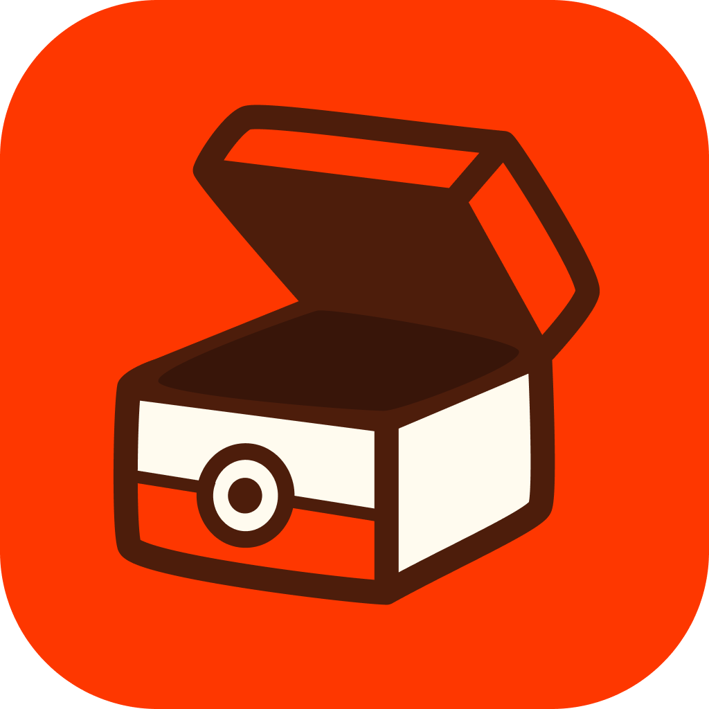
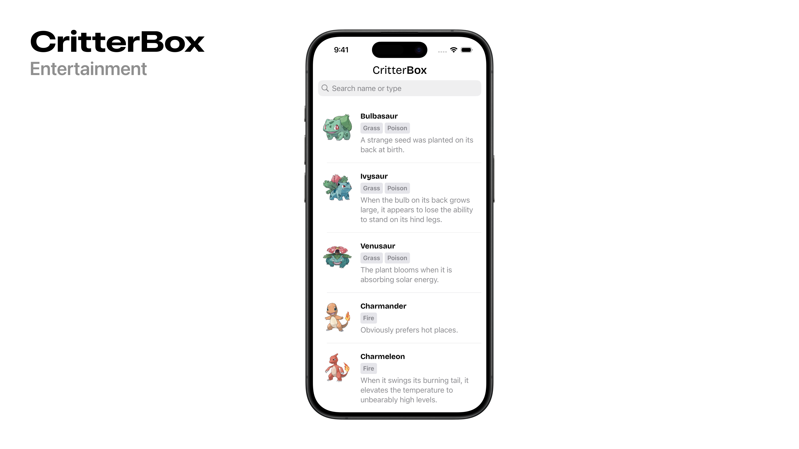

  
  <h2 align="center">
    PokemonBox
  </h2>

  

PokemonBox is an iOS app that lets you explore a rich library of Pokémon cards with ease. Designed for speed and simplicity, it offers a smooth browsing experience and intuitive search.

## Features

### Clean MVVM Architecture

Ensures separation of concerns, modularity, and a scalable codebase that’s easy to test and maintain.

### Pagination & Infinite Scrolling

Displays 20 Pokémon per page and automatically fetches the next batch as the user scrolls to the end.

### Search Capability

Includes a responsive search bar to filter Pokémon by name or type.

### Caching

* **Image Caching**: Uses `NSCache` to store Pokémon artwork in memory, reducing load times and network calls.
* **Response Caching**: `PokemonService` uses `NSCache` to cache API responses and only hits the network when needed.

### Concurrency & Performance

Built with `async/await` and `TaskGroup`s to parallelize API calls. Keeps the UI responsive by offloading work to background tasks and updating on the main thread.

### Testing

* Swift Testing Unit Tests to validate pagination, type mapping, and error handling.
* XCTest UI Tests to ensure the app launches and displays Pokémon data correctly.

 

The app incorporates accessibility features to assist our users, including support for VoiceOver.

## Requirements
- iOS 18.0+
- Xcode 16.0+

## Installation
1. Open Xcode.
2. Click on **"Clone Git Repository"**.
3. Paste the following URL: `https://github.com/matt-novoselov/PokemonBox.git`
4. Click **"Clone"**.
5. Build and run the project in Xcode.

 

## Credits
Distributed under the MIT license. See **LICENSE** for more information.

The app includes the Bricolage Grotesque font, licensed under the SIL Open Font License v1.1
© 2022 [The Bricolage Grotesque Project Authors](https://github.com/ateliertriay/bricolage)

Developed with ❤️ by Matt Novoselov
